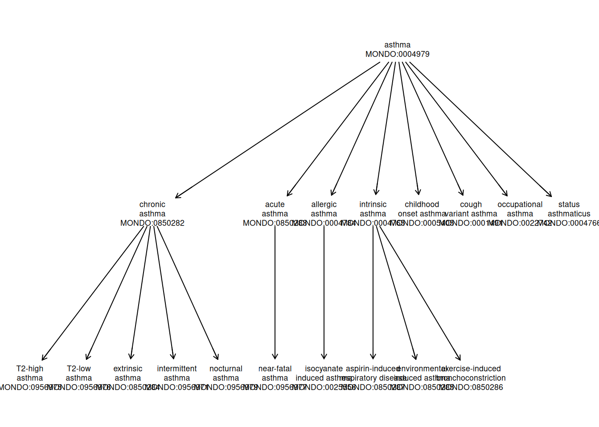
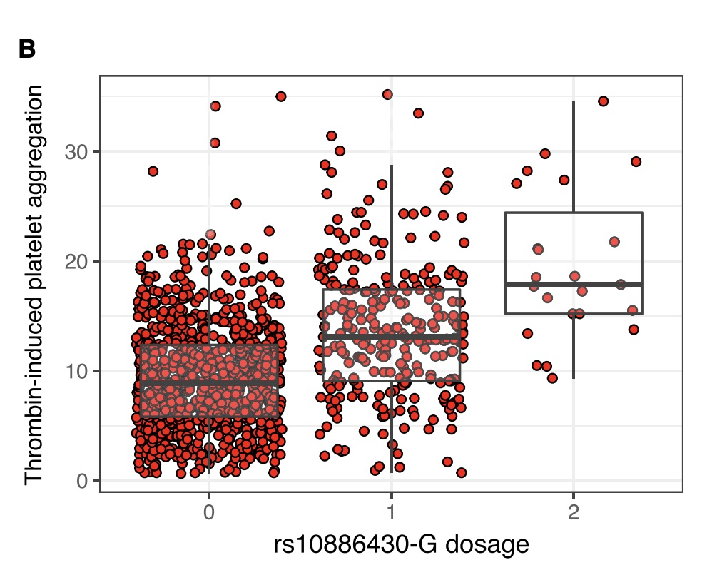
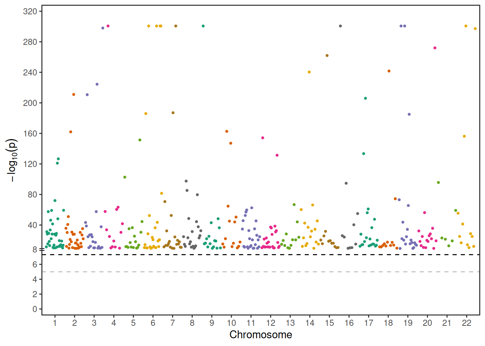

# ontoProc2 workshop for Bioc2026

## Ontology workshop for Bioc2026 with ontoProc2

We begin with an examples of an ontology for disease.

### Phenotype Vocabulary

At the boundaries of knowledge, it is important to establish conventions
to support clear communication. “Ontology” is a field of information
science devoted to formal specification of vocabularies and associated
conceptual hierarchies. Practical use of ontologies in genomic data
science started with Gene Ontology but has grown to involve frequent use
of ontologies for

- cell types
- diseases
- experimental factors and designs.

#### The MONDO disease ontology

Here is an “ontological report” on the
[MONDO](https://mondo.monarchinitiative.org/) term “exocrine pancreatic
carcinoma”, provided by the European Bioinformatics Institute Ontology
Lookup Service:


mondo snapshot

Key elements:

- definition of the short phrase or “term”
- “IRI”: a URL-like entity that can be used for web access
- “CURIE”: compact universal resource identifier of fixed length
  (MONDO:0005192)
- snapshot of conceptual hierarchy “tree”

Let’s program with the MONDO ontology. We need to have the devtools and
remotes packages installed, and then we can install the ontoProc2
package with `BiocManager::install("vjcitn/ontoProc2")`. Once this is
done, the following will succeed.

``` r

try(BiocManager::install("vjcitn/ontoProc2"))
```

    ── R CMD build ─────────────────────────────────────────────────────────────────
    * checking for file ‘/tmp/RtmpyRL0hl/remotes67318a40f69/vjcitn-ontoProc2-d875229/DESCRIPTION’ ... OK
    * preparing ‘ontoProc2’:
    * checking DESCRIPTION meta-information ... OK
    * checking for LF line-endings in source and make files and shell scripts
    * checking for empty or unneeded directories
    Removed empty directory ‘ontoProc2/.github’
    * looking to see if a ‘data/datalist’ file should be added
    * building ‘ontoProc2_0.99.25.tar.gz’

``` r

library(ontoProc2)
mondo = semsql_connect(ontology="mondo") # download on first attempt
report(mondo)
```

    ============================================================
    SemsqlConn Object
    ============================================================

    Connection Details:
    ----------------------------------------
      Database path:    /github/home/.cache/R/BiocFileCache/190193d699_mondo.db
      Ontology prefix:  MONDO
      Status:           ✓   Connected

    Database Statistics:
    ----------------------------------------
      Labeled terms:    59,064
      Direct edges:     109,103
      Entailed edges:   5,003,896
      Definitions:      22,594

    Terms by Prefix (top 5):
    ----------------------------------------
      MONDO:           31,886
      UBERON:          5,359
      HGNC:            5,023
      HP:              4,837
      GO:              4,072

    Key Tables Available:
    ----------------------------------------
      ✓  rdfs_label_statement
      ✓  has_text_definition_statement
      ✓  edge
      ✓  entailed_edge
      ✓  rdfs_subclass_of_statement
      ✓  owl_some_values_from
      ✓  has_oio_synonym_statement

    ============================================================
    Use methods like search_labels(), get_ancestors(), etc.
    Run ?SemsqlConn for documentation.
    ============================================================ 

To get precise about phenotypes of interest, we generally want to be
able to manipulate the associated CURIEs. To learn them for a word or
phrase of interest, `search_labels` can be used. We’ll focus on “asthma”
for now.

``` r

al = search_labels(mondo, "asthma")
al
```

             subject                                         label
    1    CHEBI:49167                           anti-asthmatic drug
    2    CHEBI:65023                          anti-asthmatic agent
    3   ECTO:9001829               exposure to anti-asthmatic drug
    4     HP:0002099                                        Asthma
    5   MAXO:0000634                  anti-asthmatic agent therapy
    6  MONDO:0001491                          cough variant asthma
    7  MONDO:0004765                              intrinsic asthma
    8  MONDO:0004766                            status asthmaticus
    9  MONDO:0004784                               allergic asthma
    10 MONDO:0004979                                        asthma
    11 MONDO:0005405                        childhood onset asthma
    12 MONDO:0008834 asthma, nasal polyps, and aspirin intolerance
    13 MONDO:0008835       asthma, short stature, and elevated IgA
    14 MONDO:0010940            inherited susceptibility to asthma
    15 MONDO:0011805   asthma-related traits, susceptibility to, 1
    16 MONDO:0012067   asthma-related traits, susceptibility to, 2
    17 MONDO:0012379   asthma-related traits, susceptibility to, 3
    18 MONDO:0012577   asthma-related traits, susceptibility to, 4
    19 MONDO:0012607   asthma-related traits, susceptibility to, 5
    20 MONDO:0012666   asthma-related traits, susceptibility to, 6

Now that we know an associated CURIE, we can get additional information
about its position in the conceptual hierarchy of diseases defined in
MONDO.

``` r

ainf = get_term_info(mondo, "MONDO:0004979") 
str(ainf)
```

    List of 6
     $ id          : chr "MONDO:0004979"
     $ label       :'data.frame':   1 obs. of  2 variables:
      ..$ subject: chr "MONDO:0004979"
      ..$ label  : chr "asthma"
     $ definition  : chr "A bronchial disease that is characterized by chronic inflammation and narrowing of the airways, which is caused"| __truncated__
     $ synonyms    :'data.frame':   5 obs. of  3 variables:
      ..$ subject  : chr [1:5] "MONDO:0004979" "MONDO:0004979" "MONDO:0004979" "MONDO:0004979" ...
      ..$ predicate: chr [1:5] "oio:hasNarrowSynonym" "oio:hasNarrowSynonym" "oio:hasNarrowSynonym" "oio:hasNarrowSynonym" ...
      ..$ synonym  : chr [1:5] "chronic obstructive asthma" "chronic obstructive asthma with acute exacerbation" "chronic obstructive asthma with status asthmaticus" "exercise induced asthma" ...
     $ superclasses:'data.frame':   1 obs. of  2 variables:
      ..$ id   : chr "MONDO:0001358"
      ..$ label: chr "bronchial disorder"
     $ subclasses  :'data.frame':   8 obs. of  2 variables:
      ..$ id   : chr [1:8] "MONDO:0850283" "MONDO:0004784" "MONDO:0005405" "MONDO:0850282" ...
      ..$ label: chr [1:8] "acute asthma" "allergic asthma" "childhood onset asthma" "chronic asthma" ...

``` r

tta = get_descendants(mondo, "MONDO:0004979")
str(tta)
```

    'data.frame':   18 obs. of  3 variables:
     $ id       : chr  "MONDO:0956975" "MONDO:0956976" "MONDO:0850283" "MONDO:0004784" ...
     $ label    : chr  "T2-high asthma" "T2-low asthma" "acute asthma" "allergic asthma" ...
     $ predicate: chr  "rdfs:subClassOf" "rdfs:subClassOf" "rdfs:subClassOf" "rdfs:subClassOf" ...

We will use an alternate representation of the MONDO ontology that is
useful for visualizing relationships.

``` r

data("monoi", package="op2workshop")
onto_plot2(monoi, tta$id, cex=.55)
```



#### Review

- Ontologies are structured vocabularies characterizing a conceptual
  domain
- A given term maps to a fixed-length CURIE
- Web pages about ontological terms are addressed with IRIs
- The ontoProc2 package supports interactive work with ontologies

#### Exercises

1.  Use `search_labels` to acquire information and CURIEs related to a
    disease of interest, such as hypertension, obesity.

2.  Produce a plot of the “conceptual neighborhood” of the disease you
    chose. You will need a vector of MONDO CURIEs to pass to the
    `onto_plot2` function.

### GWAS basics

Here’s an example paper for a genome-wide association study.


Johnson title

This paper provides an unusually explicit presentation of the basic
result: the distribution of a continuous outcome is shown to vary
systematically by SNP genotype.



Johnson boxplots

To help unearth the mechanisms underlying the observed relationship,
reference information on chromatin accessibility and transcription
factor binding in the vicinity of the main “hit” on chromosome 10 is
provided.


Johnson binding

A basic aim of this section is to mobilize Bioconductor and other
genomics data science resources to improve interpretability of GWAS
results.

### GWAS “Catalog”

We take for granted the existence of a catalog of genome wide
association studies (GWAS). We will start to unpack this research
concept. This table gives a flavor of topics that have been studied in
this way.

``` r

library(gwascat)
library(DT)
library(S4Vectors)
library(op2workshop)
data("gwc_110626", package="op2workshop")
#
# the following code produces an arbitrary collection of records
# from the gwas catalog, one per study instead of one per SNP
#
wrap_pmid = function(x)
  sprintf("<a href='https://pubmed.ncbi.nlm.nih.gov/%s' target='_blank'>%s</a>", x, x)
dids = (1:1000)[-which(duplicated(gwc_110626$STUDY[1:1000]))]
mc = mcols(gwc_110626[dids])
sel = as.data.frame(mc[, c("STUDY", "PUBMEDID","MAPPED_TRAIT_URI","SNPS",
  "INITIAL SAMPLE SIZE", "REPLICATION SAMPLE SIZE")])
sel$PUBMEDID = sapply(sel$PUBMEDID, wrap_pmid)
datatable(sel, escape = FALSE)
```

We’ve organized the table by ‘STUDY’ and ‘PUBMEDID’. Any given study
will produce a collection of “associations”: typically these are
single-nucleotide variants for which the allele counts are statistically
associated with presence or magnitude of some outcome. It is reasonable
to organize the entire catalog as a “GRanges” object.

``` r

gwc_110626
```

    gwasloc instance with 946062 records and 38 attributes per record.
    Extracted:  2026-06-11
    metadata()$badpos includes records for which no unique locus was given.
    Genome:  GRCh38
    Excerpt:
    GRanges object with 5 ranges and 3 metadata columns:
          seqnames    ranges strand |          DISEASE/TRAIT        SNPS   P-VALUE
             <Rle> <IRanges>  <Rle> |            <character> <character> <numeric>
      [1]        4  83020217      * | Mean corpuscular hem..   rs1563646     6e-12
      [2]        4  87047646      * | Mean corpuscular hem..   rs6854749     4e-61
      [3]        4 121854912      * | Mean corpuscular hem..   rs4833236     5e-64
      [4]        4 123835365      * | Mean corpuscular hem..  rs77173582     2e-10
      [5]        4 127878475      * | Mean corpuscular hem.. rs141430271     4e-31
      -------
      seqinfo: 24 sequences from GRCh38 genome

Our use of ontology above does not fully prepare us for the values found
in “DISEASE/TRAIT” field of the catalog.

``` r

unique(grep("[Aa]sthma", gwc_110626$`DISEASE/TRAIT`,value=TRUE)) |> head(10)
```

     [1] "Asthma"
     [2] "Asthma (time to event)"
     [3] "Adult onset asthma and/or BMI"
     [4] "Nonatopic asthma and/or BMI"
     [5] "Adult onset asthma and/or waist-to-hip ratio adjusted for BMI"
     [6] "Nonatopic asthma and/or waist-to-hip ratio adjusted for BMI"
     [7] "Adult onset asthma or type 2 diabetes"
     [8] "Nonatopic asthma or type 2 diabetes"
     [9] "Adult onset asthma or fasting glucose levels"
    [10] "Nonatopic asthma or fasting glucose levels"                   

#### Exercises

1.  For the records identified above, in which the disease phrase
    includes ‘asthma’, what CURIEs are employed in the catalog? Do they
    make sense?

2.  Pick a phenotype of epidemiological interest, determine a relevant
    CURIE, and find it in the catalog. How many SNPs are associated with
    variation in the selected phenotype?

### Manhattan plots

The summary of a genome-wide association study plots $`-\log10 p`$ for
the test of no association between SNP genotype and outcome, against the
chromsome location of the SNP.

We have a simple utility function for producing such plots for studies
in the GWAS catalog.

``` r

data("gwc_110626", package="op2workshop")
op2workshop::make_manh("GCST90002322", gwc_110626)
```

    Warning in replace_0_pval(x[[pval.colname]]): Replacing p-value of 0 with the
    minimum.



#### Exercises

1.  Produce the manhattan plot for a study of interest to you. Add the
    study title to your display. Hint: apply `ggtitle`.

2.  Arrange for the gene symbols to be plotted on the manhattan plot for
    “hits” of interest to you.

3.  (Advanced) Modify `make_manh` to produce a plotly display in which
    text such as gene name and SNP position are shown on hover.

### Functional Interpretation

We return to the colocalization of GWAS hit and TF binding peaks from
the Johnson paper.


Johnson binding

We will use the bedbaser package to interact with a large library of
“BED” files – genomic intervals with scores measuring experimental
effects observed within these intervals.

``` r

library(bedbaser)
library(GenomicRanges)

# Initialize the BEDbase API client
bb <- BEDbase()
```

We search the library for bed files for ChIP-seq experiments involving
EP300 in K562 cells. Note the limit parameter. This is an arbitrary
selection reflecting experiences with long delays with large values of
this parameter.

``` r

ep300_search <- bb_bed_text_search(
  bb,
  query = "EP300 ChIP-seq K562 hg38",
  limit = 20
)
```

Review the results in an interactive table. The search procedure [is
documented](https://docs.bedbase.org/bedbase/user/bedbase-search/).

``` r

DT::datatable(as.data.frame(ep300_search)[,-2])
```

Use the search/filter box at the top to confine attention to records
involving EP300. We will retrieve the bed file with id
“80179a031d3b0799669bd78fef60584e”.

``` r

k562_ep300_peaks <- bb_to_granges(bb, bed_id = "80179a031d3b0799669bd78fef60584e")
```

    'getOption("repos")' replaces Bioconductor standard repositories, see
    'help("repositories", package = "BiocManager")' for details.
    Replacement repositories:
        CRAN: https://p3m.dev/cran/__linux__/noble/2026-06-23

``` r

k562_ep300_peaks
```

    GRanges object with 300000 ranges and 6 metadata columns:
               seqnames              ranges strand |        name     score
                  <Rle>           <IRanges>  <Rle> | <character> <numeric>
           [1]     chr1       115585-115888      * |        <NA>         0
           [2]     chr1       778571-778874      * |        <NA>         0
           [3]     chr1       827325-827628      * |        <NA>         0
           [4]     chr1       842824-843127      * |        <NA>         0
           [5]     chr1       881702-882005      * |        <NA>         0
           ...      ...                 ...    ... .         ...       ...
      [299996]     chrX 155979690-155979993      * |        <NA>         0
      [299997]     chrX 155994673-155994976      * |        <NA>         0
      [299998]     chrX 155997561-155997864      * |        <NA>         0
      [299999]     chrX 156001644-156001799      * |        <NA>         0
      [300000]     chrX 156002490-156002793      * |        <NA>         0
               signalValue    pValue    qValue      peak
                 <numeric> <numeric> <numeric> <integer>
           [1]    15.94134        -1  3.589391       152
           [2]    17.55389        -1  3.810204       152
           [3]     4.98826        -1  0.347475       152
           [4]     5.28289        -1  0.384436       152
           [5]     6.97501        -1  0.867321       152
           ...         ...       ...       ...       ...
      [299996]     4.34307        -1  0.199389       152
      [299997]     4.77319        -1  0.279063       152
      [299998]    23.96685        -1  4.022854       152
      [299999]    75.57565        -1  4.206745        82
      [300000]    16.47409        -1  3.573077       152
      -------
      seqinfo: 711 sequences (1 circular) from hg38 genome

The SNP identified in the plot is expressed as a GRanges, so that we can
check for its relationship to an EP300 peak.

``` r

target_variant <- GRanges(
  seqnames = "chr10",
  ranges = IRanges(start = 119250744, end = 119250744)
)
subsetByOverlaps(k562_ep300_peaks, target_variant)
```

    GRanges object with 1 range and 6 metadata columns:
          seqnames              ranges strand |        name     score signalValue
             <Rle>           <IRanges>  <Rle> | <character> <numeric>   <numeric>
      [1]    chr10 119250615-119250918      * |        <NA>         0     54.7271
             pValue    qValue      peak
          <numeric> <numeric> <integer>
      [1]        -1   4.20674       152
      -------
      seqinfo: 711 sequences (1 circular) from hg38 genome

This result is consistent with the finding in the figure above.

#### Exercises

1.  The `ep300_search` table produced above has results for other cell
    lines. Are there other cell lines in which a similar finding arises?

2.  Use similar methods to check binding patterns for other
    transcription factors whose binding might be disrupted by the target
    variant. You will need to modify the query for `bb_bed_text_search`
    and acquire peak sets.

3.  “GWAS mini journal club”. Use the GWAS catalog to identify studies,
    genes, and SNPs of interest to you. Prepare a short presentation on

- the phenotype or disease under study,
- the population in which the study was conducted, and the study design,
- the minor allele frequencies of identified “hits”,
- the scope of associations discovered,
- prospects for functional interpretation of the associations using
  bedbase or other tools.
